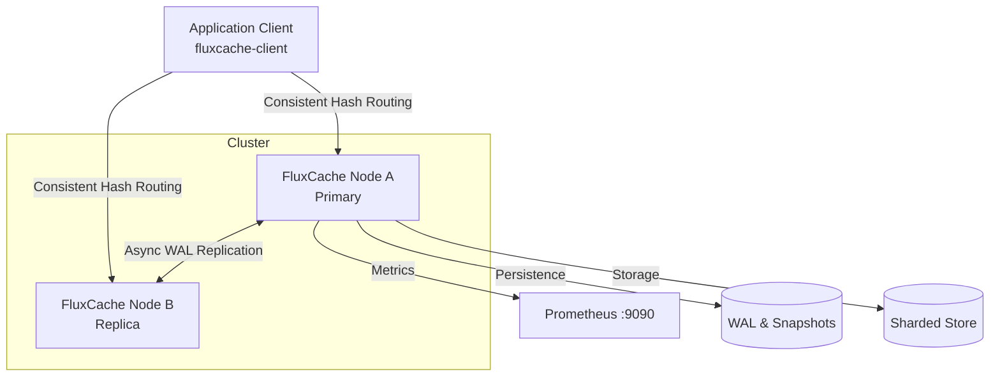

# FluxCache

**FluxCache --- Distributed Multi-Tier Cache | Rust, Tokio, TCP, WAL, Consistent Hashing**

## 1. What FluxCache is
FluxCache is a production-style, high-performance distributed cache server built entirely from scratch in Rust. It serves as an in-memory key-value store optimized for massive concurrency, millisecond latency, and native High-Availability capabilities. 

## 2. Why it exists
FluxCache was built as a portfolio-grade systems engineering project to demonstrate advanced distributed systems programming in Rust. It is built natively without relying on external core abstractions like Redis. It explores lock-free abstractions, concurrent hash maps, native TCP byte-framed parsers, and custom write-ahead logging (WAL).

## 3. Architecture Diagram


## 4. Features
- **TCP Protocol**: Custom binary/text framed protocol.
- **Eviction Policies**: strict LRU and aging LFU variants.
- **TTL & Expiration**: Background sweeping and lazy eviction.
- **Request Coalescing**: "Single-flight" caching prevents cache-stampedes on cold keys.
  
  ```mermaid
  sequenceDiagram
      participant C1 as Client 1
      participant C2 as Client 2
      participant FC as FluxCache
      participant DB as Backend Loader
      
      C1->>FC: GET_OR_LOAD key
      FC->>DB: Execute Loader
      Note over FC,DB: In-flight loader active
      C2->>FC: GET_OR_LOAD key
      Note over FC: Subscribes to active loader
      DB-->>FC: Data Result
      FC-->>C1: Data Result
      FC-->>C2: Data Result
  ```
  
- **Clustering**: Consistent-hashing (`xxh3`) integrated deeply in the client SDK.
- **Replication**: Internal async broadcast streaming of Point-in-Time Snapshots and WAL.

  ```mermaid
  sequenceDiagram
      participant Primary
      participant Replica
      
      Replica->>Primary: PSYNC
      Note over Primary: Triggers Point-in-time Snapshot
      Primary-->>Replica: FULLRESYNC (Binary Snapshot)
      Note over Replica: Drops memory, bulk-loads Snapshot
      loop Continuous
          Primary-->>Replica: Stream live WAL mutations
          Note over Replica: Apply WAL changes natively
      end
  ```

- **Persistence**: Atomic crash-tolerant WAL and Checksummed binary Snapshots.
- **Observability**: Built-in Prometheus metrics and HTTP admin plane.

## 5. Protocol Example
FluxCache speaks a custom framed protocol natively over TCP:
```text
SET user:123 "john doe"\r\n
+OK\r\n
GET user:123\r\n
$8\r\njohn doe\r\n
```

## 6. Quick Start
Start the server:
```bash
cargo run --release -- --listen 127.0.0.1:6380 --admin-listen 127.0.0.1:9090 --eviction-policy lru --max-memory 512mb
```
Or start via Docker:
```bash
docker build -t fluxcache .
docker run -p 6380:6380 -p 9090:9090 fluxcache
```

## 7. Configuration
| Flag | Description | Default |
|---|---|---|
| `--listen` | TCP Address to listen on | `127.0.0.1:6380` |
| `--admin-listen` | HTTP Address to listen on for metrics | `127.0.0.1:9090` |
| `--eviction-policy` | Memory eviction strategy (`lru`, `lfu`, `none`) | `lru` |
| `--max-memory` | Memory limit (e.g., 512mb, 1gb) | `256mb` |
| `--persistence` | Enable disk persistence | `false` |
| `--replica-of` | Address of primary node for clustering | None |

## 8. Performance Methodology
Benchmarks are orchestrated using our custom `fluxcache-bench` client framework.
We spawn a Tokio-backed TCP multi-worker thread pool that drives highly concurrent traffic over persistent pipelined connections to a single local FluxCache daemon in `--release` mode.

- **Hardware**: Linux Localhost 
- **Workload Size**: 100,000 Operations
- **Concurrency**: 50 Parallel Clients
- **Payload**: 256 bytes per request
- **Distribution**: 80% GET, 20% SET over a 10,000 pre-populated keyspace.

## 9. Benchmark Results
FluxCache achieved **>214,000 requests/sec** under sustained load with sub-millisecond p99 latency natively.

```text
========================================================
RESULTS
========================================================
Time taken:       0.47 seconds
Total Requests:   100000
Throughput:       214,376.79 req/sec

Latency (microseconds):
  Min:  27
  p50:  204
  p95:  450
  p99:  638
  Max:  1518
========================================================
```

## 10. Failure Model
If a node crashes, all in-memory data is preserved as long as `--persistence true` is enabled. The node will automatically reconstruct the state from the `fluxcache.snap` binary file, and replay the `fluxcache.wal` log to regain parity. Any malformed WAL records or corrupted checksums cause recovery to gracefully halt at the last known good sequence.

## 11. Durability Guarantees
FluxCache flushes WAL records based on `--wal-sync-interval-ms` (default 100ms). This represents a window of up to 100ms of potential data loss upon sudden power loss. Disk writes are checksummed using CRC32 to guarantee corruption detection.

## 12. Design Trade-offs
- **Locking vs Lock-Free**: We utilize `Arc<Mutex<>>` Shards over highly partitioned `BTreeMap` structures instead of crossbeam lock-free maps. This improves sequential iteration speed for LRU eviction at a small cost to raw concurrent contention.
- **Protocol overhead**: We opted for a raw ASCII string parser with length-prefixed binary strings instead of FlatBuffers/Protobuf to minimize byte overhead on small payloads.

## 13. Roadmap
- [ ] Add Raft Consensus for fully automatic Leader Election without static `--replica-of` arguments.
- [ ] Implement `ZSET` (Sorted Sets) natively.
- [ ] Build a true zero-copy `io_uring` underlying connection backend.

## 14. Limitations
- Values cannot exceed `--max-request-size` (1MB default).
- Snapshots block the internal worker pool; future iterations should `fork()` or deeply clone the `BTreeMap` copy-on-write trees.
